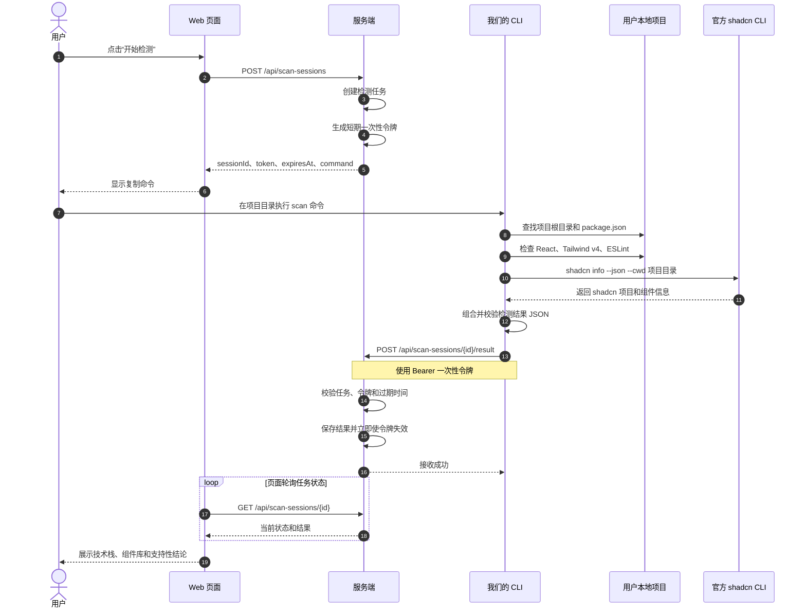
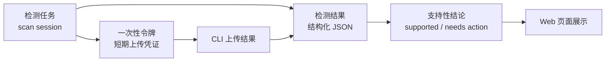
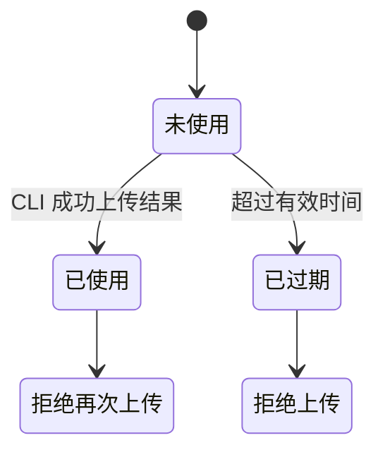
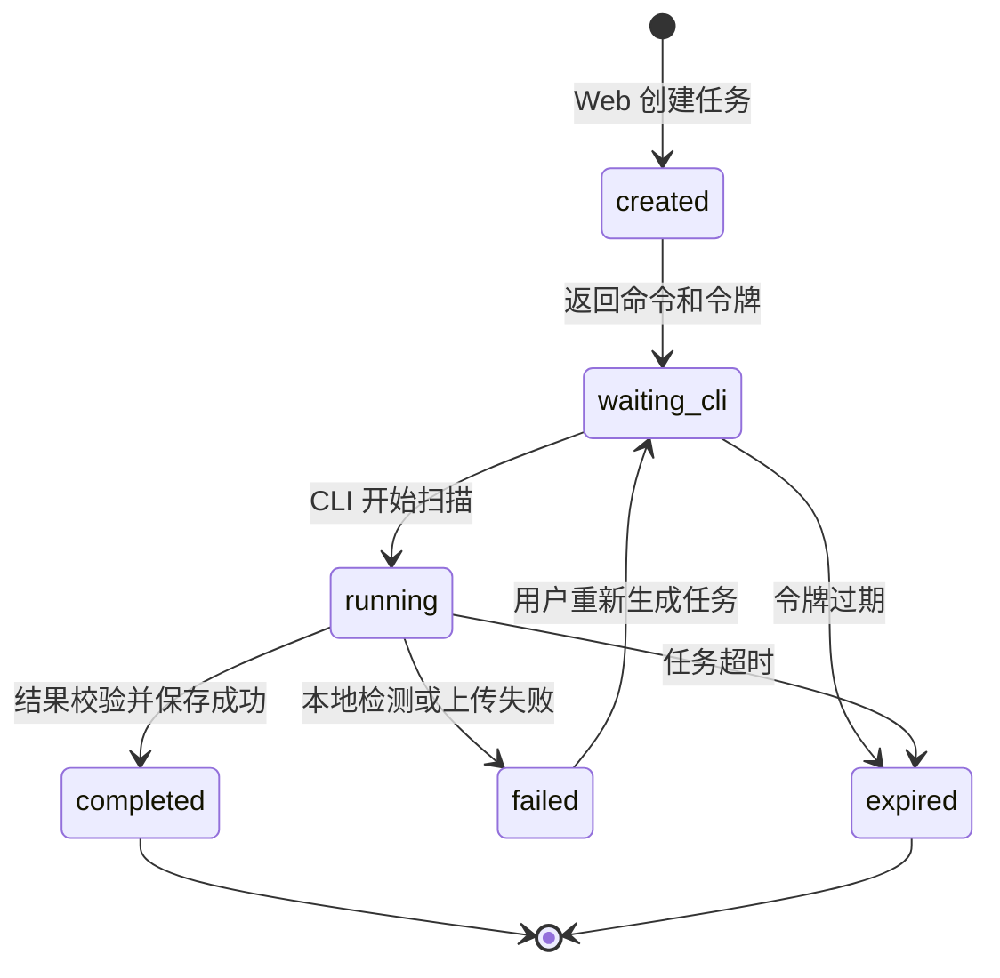
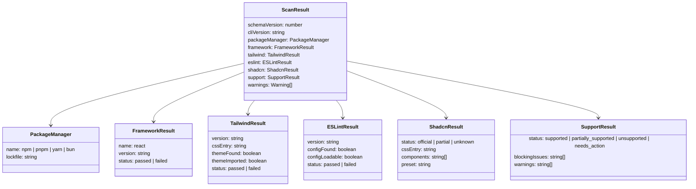

# 工单一：检测任务与接口协议

## 1. 一张图看完整流程



## 2. 四个核心对象



### 检测任务

检测任务表示一次具体的项目检测。它不是用户项目本身，同一个项目可以反复创建新的检测任务。

任务状态：

```text
created（已创建）
waiting_cli（等待 CLI）
running（检测中）
completed（已完成）
failed（失败）
expired（已过期）
```

### 一次性令牌

一次性令牌是服务端为单次任务生成的短期上传凭证。它只允许 CLI 上传当前任务的结果，成功上传后立即失效。



服务端只保存令牌哈希值，不保存明文令牌。令牌不承担用户登录功能，也不作为长期 API Key（接口密钥）。

## 3. 任务状态变化



## 4. 结果模型

检测结果只描述项目环境和检测结论，不包含源码正文、环境变量或密钥。



结果示例：

```json
{
  "schemaVersion": 1,
  "cliVersion": "0.1.0",
  "packageManager": {
    "name": "npm",
    "lockfile": "package-lock.json"
  },
  "framework": {
    "name": "react",
    "version": "19.2.8",
    "status": "passed"
  },
  "tailwind": {
    "version": "4.3.3",
    "cssEntry": "src/index.css",
    "themeFound": true,
    "themeImported": true,
    "status": "passed"
  },
  "eslint": {
    "version": "10.11.0",
    "configFound": true,
    "configLoadable": true,
    "status": "passed"
  },
  "shadcn": {
    "status": "official",
    "cssEntry": "src/index.css",
    "components": ["button", "card", "input"],
    "preset": "base-nova"
  },
  "support": {
    "status": "supported",
    "blockingIssues": [],
    "warnings": []
  },
  "warnings": []
}
```

## 5. 接口协议

### 创建检测任务

```text
POST /api/scan-sessions
```

返回：

```json
{
  "sessionId": "scan_123",
  "token": "短期一次性令牌",
  "expiresAt": "2026-09-24T12:00:00Z",
  "command": "npx @design-guardrails/cli scan --project scan_123 --token 短期一次性令牌"
}
```

### CLI 上传结果

```text
POST /api/scan-sessions/{sessionId}/result
Authorization: Bearer <token>
Content-Type: application/json
```

请求体是 `ScanResult`（检测结果模型）。

成功返回：

```json
{
  "accepted": true,
  "status": "completed"
}
```

### Web 查询任务状态

```text
GET /api/scan-sessions/{sessionId}
```

返回：

```json
{
  "sessionId": "scan_123",
  "status": "completed",
  "result": {},
  "error": null
}
```

## 6. 协议边界

服务端负责任务、令牌、状态和结果保存；CLI 负责本地读取和检测；Web 负责创建任务、复制命令、轮询状态和展示结果。

CLI 不上传：

- 源码正文；
- `.env`（环境变量）文件；
- 密钥和令牌；
- 完整配置文件内容；
- `node_modules`（依赖目录）。

工单一完成后，工单二、工单三和工单四可以依据这份文档并行实现服务端、Web 页面和 CLI。
