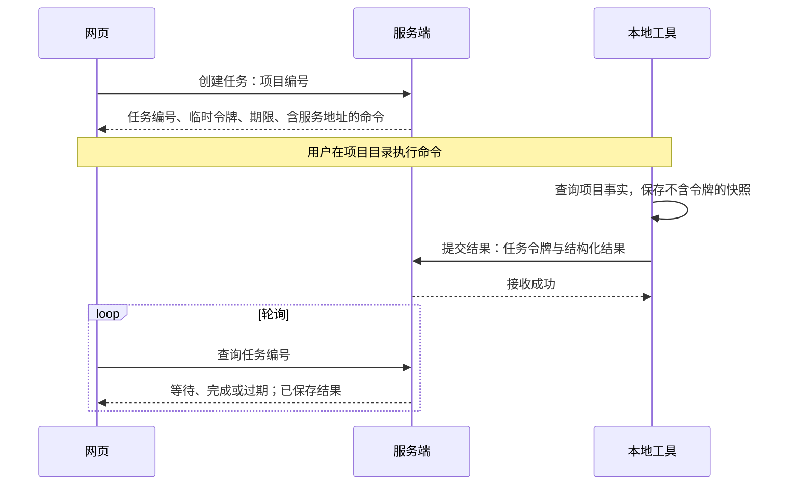
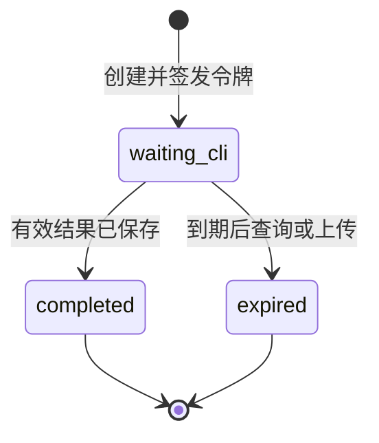

# 工单一：检测任务与共享协议

当前结果协议：第二版。它只表达项目接入事实，不代表已经建立或检查过完整设计体系。

## 流程与接口

```mermaid
sequenceDiagram
    participant Web as 网页
    participant Server as 服务端
    participant CLI as 本地工具
    Web->>Server: 创建任务：项目编号
    Server-->>Web: 任务编号、临时令牌、期限、含服务地址的命令
    Note over Web,CLI: 用户在项目目录执行命令
    CLI->>CLI: 查询项目事实，保存不含令牌的快照
    CLI->>Server: 提交结果：任务令牌与结构化结果
    Server-->>CLI: 接收成功
    loop 轮询
        Web->>Server: 查询任务编号
        Server-->>Web: 等待、完成或过期；已保存结果
    end
```

接口保持三项：

- `POST /api/scan-sessions`（创建任务）：请求含 `projectId`（项目编号）；成功状态码 201。
- `POST /api/scan-sessions/:id/result`（上传结果）：请求体为 `{ result: ... }`（结果外层对象），请求头携带一次性令牌；成功状态码 202。
- `GET /api/scan-sessions/:id`（查询任务）：返回任务状态、结果和错误；成功状态码 200。

创建响应含 `sessionId`（任务编号）、`token`（临时令牌）、`expiresAt`（到期时间）、`command`（执行命令）。命令统一用 `--session`（任务编号参数），并含 `--server`（服务地址）。命令行包尚未公开发布，本地联调使用本地安装包。

## 任务状态

```mermaid
stateDiagram-v2
    [*] --> waiting_cli: 创建并签发令牌
    waiting_cli --> completed: 有效结果已保存
    waiting_cli --> expired: 到期后查询或上传
    completed --> [*]
    expired --> [*]
```

`waiting_cli`（等待结果）、`completed`（结果已接收）和 `expired`（已过期）是当前实现的全部服务状态。检测失败或断网暂由本地工具提示，不存在开始检测或失败上报接口。过期在查询或上传时按时间判定，不依赖后台定时任务。

完成只说明结果已保存，不说明项目受支持；项目是否可继续由结果中的支持性结论表达。

## 结果结构

| 字段 | 含义 |
|---|---|
| `schemaVersion`（协议版本） | 当前为 2 |
| `cliVersion`（工具版本） | 产生结果的工具版本 |
| `tailwind`（样式框架事实） | 已安装、未安装、未知或未检测，以及实际版本；未检测不伪造版本 |
| `theme`（主题定位事实） | 定位到路径、未找到、查询失败或未查询；有路径时说明官方查询或用户确认来源 |
| `shadcn`（组件方案事实） | 已配置、未配置、查询失败或未查询；配置时附官方返回的信息 |
| `componentLibraries`（组件候选） | 候选名称、状态和依据；不再使用没有评分依据的可信度等级 |
| `support`（接入结论） | 可继续程度及阻断原因、提示 |
| `warnings`（诊断提示） | 固定原因码、说明和严重程度 |

删除框架名称、代码检查器可加载性、主题是否全项目引用、必填包管理器画像。那些不是当前接入目标，不能由协议逼着检测器编造。

主题路径只能是项目内部相对路径；未知字段拒绝接收。路径查询不证明应用实际加载，也不证明该文件包含全部设计令牌。

## 令牌与错误

令牌默认十分钟有效，服务端仅保存哈希，成功提交后不可再次写入；网络丢失响应后由客户端查询并比对结果确认是否成功。令牌不保存在快照里。

请求格式错误返回 400；缺少或无效令牌返回 401；任务不存在返回 404；已使用返回 409；过期返回 410；正文过大返回 413；内部存储等错误返回脱敏的 500。

配置生成或编辑主题不需要此处预先安装代码检查器，正式规则执行再检查宿主与解析器。

## 第二版兼容边界

旧协议的快照明确拒绝，提示重新扫描。数据库历史记录保留，但旧结果查询返回无结果及版本不支持提示，不悄悄转换为新的事实。项目尚未公开发布，不继续维护没有用户需求的旧命令参数别名。

新结果模型由共享协议包直接校验，示例由自动化测试覆盖；说明不再维护一份容易与实现漂移的完整复制字段示例。
