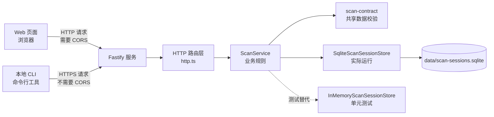
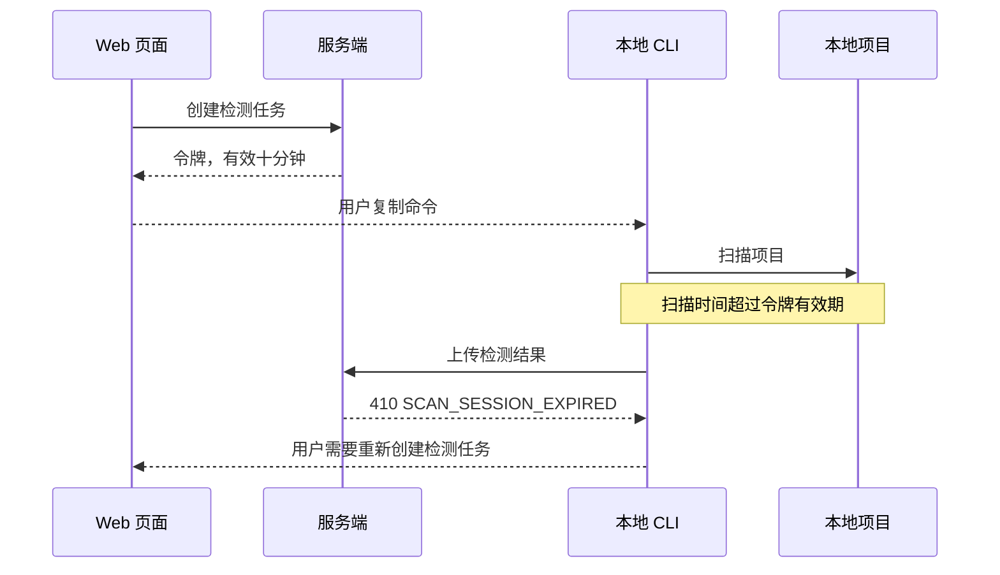
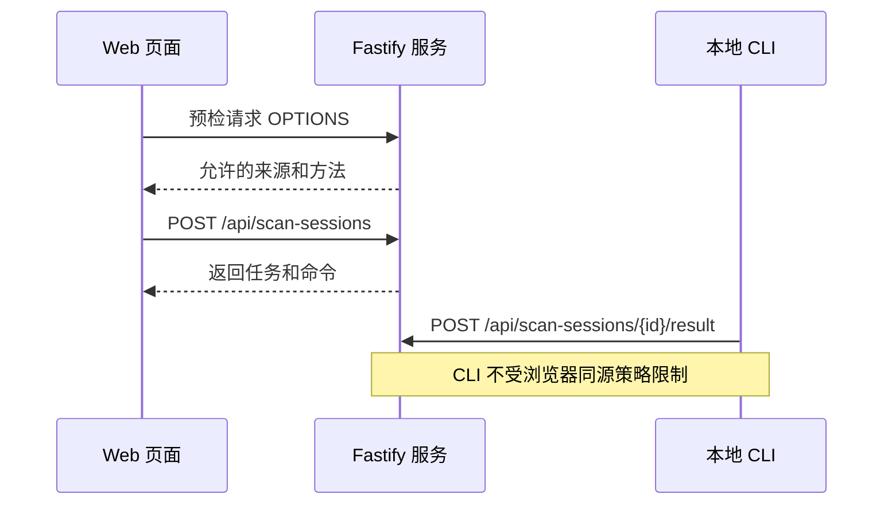
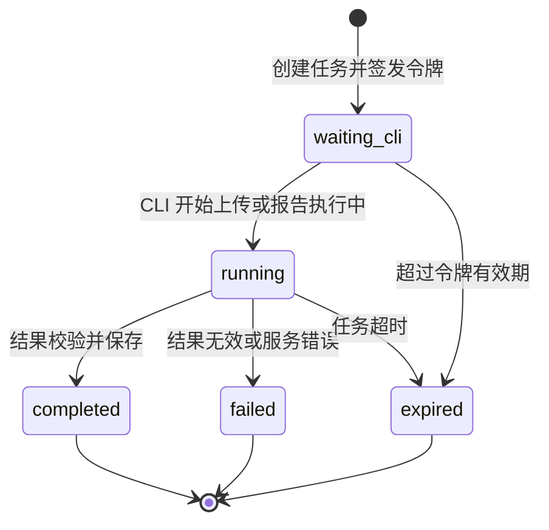

# 工单二：服务端、令牌和 Fastify

## 1. 当前实现结论

工单二的服务端由 Fastify（Node.js 服务框架）提供 HTTP（网络接口）能力，业务逻辑由 `ScanService`（检测任务服务）负责，任务数据默认保存到 SQLite（本地文件数据库）。

```text
apps/server/src/main.ts
  启动服务、创建 SQLite 存储

packages/scan-service/src/http.ts
  注册 HTTP 路由、解析请求、返回状态码

packages/scan-service/src/service.ts
  创建任务、生成令牌、校验令牌、保存结果、更新状态

packages/scan-service/src/store.ts
  InMemoryScanSessionStore：测试用内存存储
  SqliteScanSessionStore：实际运行用 SQLite 存储
```

## 2. 架构图



职责边界：

| 部分 | 负责什么 | 不负责什么 |
|---|---|---|
| Web 页面 | 创建任务、复制命令、查询状态 | 读取本地项目 |
| CLI | 扫描本地项目、上传结果 | 保存任务状态 |
| Fastify | 接收 HTTP 请求、路由和响应 | 判断项目是否合规 |
| `ScanService` | 任务状态、令牌、结果接收 | 扫描源码 |
| SQLite 存储 | 持久化任务和结果 | 生成业务结论 |
| 共享协议包 | 校验请求和结果结构 | 处理网络请求 |

## 3. 一次性令牌超过十分钟怎么办

当前代码默认令牌有效期为十分钟。这个时间不是 Fastify 的要求，而是 `ScanService` 的业务配置。

```text
创建任务 → 令牌有效十分钟
CLI 扫描耗时超过十分钟
CLI 上传结果 → 服务端返回 410
任务状态 → expired（已过期）
```



当前行为是安全但不够友好：结果不会被服务端接受，用户需要回到网页重新创建任务，再重新执行 CLI。后续 CLI 应该把本地结果保存下来，并把错误提示成“检测任务已过期，请回网页重新生成命令”，而不是直接丢失结果。

有效期的取舍：

| 有效期 | 优点 | 缺点 |
|---|---|---|
| 10 分钟 | 令牌暴露窗口较短 | 安装依赖或网络较慢时容易过期 |
| 30 分钟 | 更适合第一次接入和下载依赖 | 令牌有效窗口变长 |
| 60 分钟 | 基本不会阻塞长扫描 | 临时令牌暴露时间更长 |

MVP 当前保留十分钟作为实现默认值；如果真实测试发现首次扫描经常超过十分钟，应把默认值调整为三十分钟，同时保留服务配置能力。令牌不应该在 CLI 扫描过程中自动延长，因为这会削弱“一次性、短期凭证”的边界。

## 4. 256KB 请求体限制是什么

256KB（千字节）不是 Fastify 的强制要求，是本项目显式设置的产品限制：

```ts
Fastify({ bodyLimit: 256 * 1024 })
```

第一阶段上传的是项目元数据和检测结论，不包含源码，所以 256KB 已经足够。它用于防止误把源码、构建产物或超大日志发到服务端。

如果以后结果模型增加大量诊断信息，可以把限制改为 512KB 或 1MB。这个值应该是服务端配置，而不是写死在 CLI 中。超过限制时 Fastify 返回 413（请求体过大）。

## 5. 跨域请求支持是什么

跨域请求指浏览器页面和接口服务使用了不同的来源（协议、域名或端口）。例如：

```text
Web 页面：http://localhost:3000
服务端：http://127.0.0.1:3001
```

浏览器默认会阻止页面直接调用另一个来源的接口。Fastify 注册 `@fastify/cors`（跨域请求插件）后，浏览器才可以调用服务端接口。



当前开发环境使用 `origin: true`，允许所有来源，方便本地 Web 联调。生产环境应改为只允许正式 Web 地址，不能继续开放所有来源。

## 6. 内存存储和 SQLite 存储到底用哪一个

实际运行使用 SQLite：

```text
apps/server/src/main.ts
  → SqliteScanSessionStore
  → data/scan-sessions.sqlite
```

内存存储只用于测试：

```text
http.test.ts
service.test.ts
  → InMemoryScanSessionStore
```

这样做是为了让单元测试不依赖真实数据库，同时让本地服务可以验证重启后任务是否仍然存在。以后部署到云端时，可以保留 `ScanSessionStore`（存储接口），再增加 PostgreSQL（关系数据库）实现，不需要改 `ScanService`。

## 7. Fastify 在项目中提供什么

Fastify 只负责 HTTP 外壳，具体有这些能力：

- 启动端口并监听请求；
- 根据路径和方法找到处理函数；
- 解析 JSON 请求体；
- 执行请求体大小限制；
- 调用 CORS 插件；
- 返回 JSON 和 HTTP 状态码；
- 通过 `app.inject`（内存请求测试）测试接口，不必真的打开端口。

Fastify 不负责：

- 判断 React、Tailwind 或 ESLint；
- 调用 shadcn CLI；
- 判断检测结果是否支持；
- 生成一次性令牌的业务规则；
- 保存数据库记录。

学习本项目中的 Fastify，按这个顺序阅读：

1. `apps/server/src/main.ts`：看服务如何启动；
2. `packages/scan-service/src/http.ts`：看三个接口如何注册；
3. `packages/scan-service/src/http.test.ts`：看如何模拟请求；
4. `packages/scan-service/src/service.ts`：看路由如何调用业务服务。

本地运行：

```bash
npm run dev:server
```

然后访问：

```text
http://127.0.0.1:3001
```

Fastify 官方资料：

- 路由：https://fastify.dev/docs/latest/Reference/Routes/
- 服务启动：https://fastify.dev/docs/latest/Reference/Server/
- 测试注入：https://fastify.dev/docs/latest/Reference/Inject/

## 8. 任务状态图



工单二完成后，工单三可以直接使用创建任务和查询状态接口；工单四可以使用结果上传接口。
