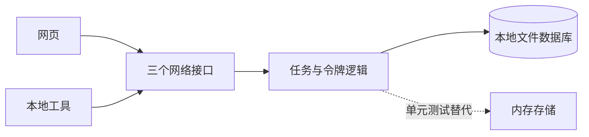
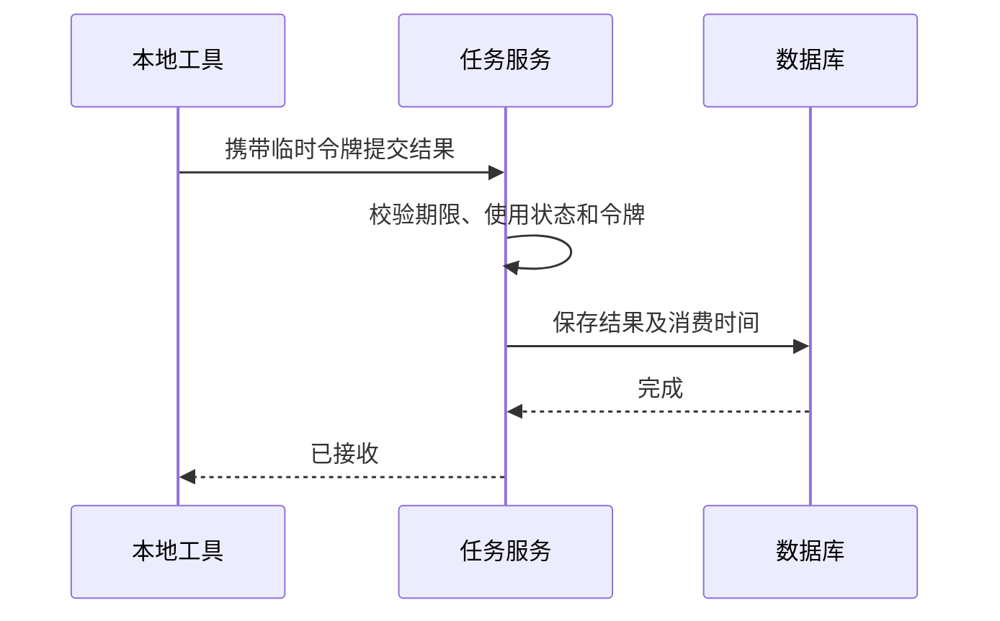

# 工单二：检测任务服务

## 职责

`Fastify`（网络服务框架）负责路由、请求解析与响应。任务服务负责签发和验证令牌、保存结果。正式本地启动使用 `SQLite`（文件数据库），内存存储仅用于测试。

```mermaid
flowchart LR
    W[网页] --> H[三个网络接口]
    C[本地工具] --> H
    H --> S[任务与令牌逻辑]
    S --> D[(本地文件数据库)]
    S -. 单元测试替代 .-> M[内存存储]
```

## 当前状态与限制

状态只包含等待结果、完成、过期。本地扫描进度与失败尚无接口上报，因此服务器不会自动知道扫描已开始；页面不能据旧图展示不存在的真实进度。

上传令牌默认十分钟；超过期限提交返回过期，客户端保留快照。用户新建任务后可换用新编号和令牌重传同一份快照；不自动延长令牌。

请求正文上限是本项目选择的 256 千字节，不是服务框架强制要求。超限返回 413。结构化结果仍须符合共享协议，版本未知或参数错误不会被保存。

## 服务地址和网页来源

本地服务默认监听本机 3001 端口。修改 `PORT`（监听端口配置）后，生成命令应自动包含实际本地地址。

使用反向代理或公开域名时设置 `PUBLIC_ORIGIN`（对外服务地址），命令使用这个地址，不依据请求主机头拼接凭证命令。网页和服务端不同源时设置 `WEB_ORIGIN`（允许访问的网页来源）。默认不开启任意来源跨域；命令行不受浏览器同源策略限制。

三个接口响应都不应被浏览器或代理缓存。内部故障返回通用 500，不能伪装成用户请求错误；日志只记录固定内部错误码，不直接输出可能含秘密的异常正文。

## 本地运行与存储

主仓库运行 `npm run dev:server`（启动服务）。数据库默认在被忽略的数据目录中，`SCAN_DATA_DIR`（数据目录配置）可调整位置。

```mermaid
sequenceDiagram
    participant CLI as 本地工具
    participant Service as 任务服务
    participant DB as 数据库
    CLI->>Service: 携带临时令牌提交结果
    Service->>Service: 校验期限、使用状态和令牌
    Service->>DB: 保存结果及消费时间
    DB-->>Service: 完成
    Service-->>CLI: 已接收
```

当前服务是本地开发实现，尚无用户登录、项目所有权和多租户隔离，不能直接当作可公开上线的用户服务。这是部署前需要单独完善的事项，本轮不借审核扩大到账户系统开发。

## 学习资料

理解本项目时先看启动入口，再看路由如何调用任务服务，最后看存储与接口测试。

- [服务框架官方路由说明](https://fastify.dev/docs/latest/Reference/Routes/)
- [服务框架启动配置](https://fastify.dev/docs/latest/Reference/Server/)
- [官方测试指南](https://fastify.dev/docs/latest/Guides/Testing/)
