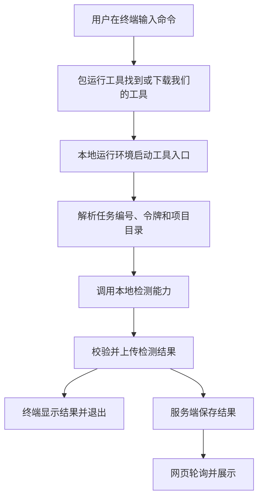

# 工单四学习：命令行工具如何工作

这份教程用于实现前理解原理，不代表工单四已经开始开发。建议按下面顺序阅读，再按需打开官方资料。

## 1. 我们到底要造什么

`CLI`（命令行界面）是一种操作程序的方式。网页通过按钮和输入框接收操作，命令行工具通过命令和参数接收操作。

我们的工具是在用户电脑运行的一个程序。用户启动它，它读取指定项目、调用检测能力、发送结果，然后退出。服务端则持续等待网页和工具发来的请求。



## 2. 先会启动一个普通程序

[官方入门：从命令行运行程序](https://nodejs.org/en/learn/command-line/run-nodejs-scripts-from-the-command-line)。先读直接运行脚本的部分，其他运行方式暂时跳过。

`Node.js`（脚本运行环境）让脚本可以在浏览器之外运行，因此可以访问本地文件、启动子进程和发送网络请求。

下面只是教学示例，不需要现在在仓库创建文件。假设有一个打印目录的脚本：

```js
// 当前目录：用户从哪个目录启动程序。
console.log('扫描位置：', process.cwd())

// 参数列表：跳过运行环境路径和脚本路径后，才是用户传入的参数。
console.log('教学参数：', process.argv.slice(2))
```

`process.cwd()`（当前工作目录）和 `process.argv`（启动参数列表）来自运行环境。真实工具不能照搬第二行打印全部参数，因为其中可能有令牌。

关键区别：**工具的安装位置，不等于待扫描项目的位置**。工具可能位于下载缓存里，但用户是在测试项目目录启动它的。我们默认使用当前目录，并允许用户明确指定另一个目录。

依据：[官方进程接口](https://nodejs.org/api/process.html)。

## 3. 再学参数解析，不用自己拆字符串

推荐 [Commander.js 官方入门](https://github.com/tj/commander.js#quick-start)（命令行参数解析工具）。先读快速开始，再读选项、必填选项和帮助信息。

它把命令转换成我们代码可读取的数据，并处理缺少必填参数、未知选项、帮助说明等常见情况。它不会替我们扫描项目或上传结果。

| 命令的一部分 | 含义 |
|---|---|
| `scan`（扫描子命令） | 用户要执行的操作 |
| `--project`（现有协议中的任务编号参数） | 当前实现传的是检测任务编号，不是项目编号；后续应统一命名 |
| `--token`（临时上传令牌） | 允许这次任务上传结果的凭证 |
| `--server`（服务地址） | 结果发往哪里 |
| `--help`（帮助选项） | 用户不知道用法时查看说明 |

学习目标：能解释“工具启动成功”和“参数是否合法”是两件事。参数不合法时，应先提示，不开始扫描。

## 4. 从脚本变成可安装的命令

阅读 [官方包清单中的命令入口说明](https://docs.npmjs.com/cli/v11/configuring-npm/package-json#bin)。

`package.json`（包清单）的 `bin`（命令入口映射）声明：哪个命令名对应哪个入口文件。`npm`（包管理工具）安装包时，会为入口建立可执行命令；在 Windows（视窗系统）上会生成相应的命令包装文件。

再看 [官方临时执行说明](https://docs.npmjs.com/cli/v11/commands/npm-exec)。`npx`（包命令执行工具）负责找到并执行包的命令，必要时下载包。它不扫描项目，也不把工具变成服务器。

开发阶段可以先用 [本地链接](https://docs.npmjs.com/cli/v11/commands/npm-link)，或打包后在独立测试环境安装，不需要先发布公共包。我们的包名还没有发布，目前文档里的远程执行命令只是目标用法。

项目使用 `TypeScript`（带类型的脚本语言）。通常将它构建为 `JavaScript`（运行时脚本），再让命令入口指向构建产物。当前主仓库的类型检查不会生成这些文件，工单四需要补上实际运行和打包方式。

## 5. 工具如何和服务端通信

阅读 [官方网络请求教程](https://nodejs.org/en/learn/getting-started/fetch)。`fetch`（网络请求函数）可以把结构化结果发送到服务端。

在本项目里，工具会先用共享协议校验结果，再请求工单二的上传接口。业务状态码需要自己处理：收到错误状态码，不代表请求函数一定会抛出异常。

需要分清三种失败：参数错误时还没开始扫描；扫描错误发生在用户电脑；上传错误发生在网络或服务端。提示不能统一成“扫描失败”。

断网时可以保留本地结果；令牌过期需要重新授权；服务器已经接收、响应却丢失时，应查询任务状态，不能盲目把重复上传失败当成扫描失败。

## 6. 调用官方工具，是下一层能力

我们的程序还可以启动另一个程序，这叫子进程。后续工单六会执行官方 `shadcn info --json`（组件方案的结构化项目查询命令），读取它的结果。

可参考 [Execa 维护者文档](https://github.com/sindresorhus/execa)（子进程工具），先理解工作目录、输出、退出码和超时。它只是调用官方命令，不会取代官方检测逻辑，也不要求用户再手动运行一遍。

`stdout`（标准输出）用于程序结果，`stderr`（标准错误输出）可用于进度与错误提示；`exitCode`（退出码）告诉外部程序本次是否成功。先掌握这三个概念，动画、交互菜单和终端配色可以以后再学。

## 7. 对照我们的开发顺序

| 工单 | 负责的能力 |
|---|---|
| 四 | 命令入口、目录选择、执行组织、结果回传和失败提示 |
| 五 | 真正检测本地技术栈 |
| 六 | 调用官方组件查询 |
| 七 | 汇总为支持性结论 |

读完后，能解释以下三件事，就足够开始工单四：命令如何启动本地程序；为什么程序能扫描当前项目而不是自己的安装目录；检测结果如何通过网络到达网页背后的服务端。
