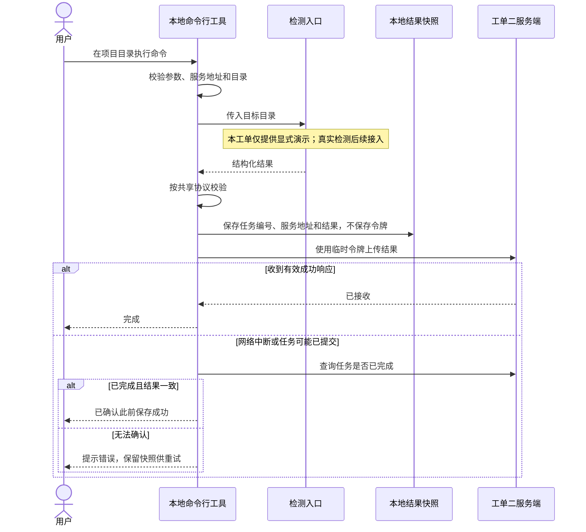

# 工单四：本地命令入口与结果回传

状态：已实现并通过本地安装验证，2026-09-28。

## 现在可以做什么

`CLI`（命令行工具）已经具备参数解析、目录选择、检测入口、共享协议校验、本地快照、网络上传和失败恢复。

真实环境检测属于工单五，官方组件查询属于工单六。本工单用 `--demo`（通信演示选项）显式验证回传，不读取项目源码、配置或环境变量文件。演示结果带有 `DEMO_ONLY`（仅演示）标记，并返回需要处理的支持性结论，不能当作真实检测通过。

没有选择演示、又没有接入检测器时，工具会报错退出，不生成假检测结果。后续检测器通过接收项目目录、返回共享结果模型的入口接入。



目前服务端没有开始检测和进度上报接口，因此检测过程只在终端展示。服务端仍是等待结果、已完成或已过期；不会声称网页已经能看到实时扫描进度。

## 构建和本地安装

在主仓库运行 `npm run pack:cli`（构建并生成本地安装包）。它自动创建产物目录，输出下面示例所使用的压缩包。

在独立测试项目中安装并查看帮助：

```powershell
Set-Location F:\lint-shadcn-tailwind-test
npm install --no-save --package-lock=false --ignore-scripts F:\lint\artifacts\design-guardrails-cli-0.1.0.tgz
npm exec --offline -- design-guardrails --help
```

其中 `--no-save`（不修改包清单）和 `--package-lock=false`（不修改锁文件）避免把本机安装路径写入测试项目；`--offline`（离线执行）确保使用已安装的工具，不去网上找同名包。

安装包只包含入口程序、第三方许可和包清单。共享协议、参数解析和数据校验依赖已打入入口，不需要从公开包仓库下载我们尚未发布的私有工作区包。

包仍标为私有，尚未公开发布。服务端生成的远程包执行命令暂不能直接用于网上安装。

## 运行演示与重试

先在主仓库运行 `npm run dev:server`（启动本地服务），并通过已实现的创建任务接口取得任务编号和令牌。用真实返回值替换下面的占位符，再在测试项目运行：

```powershell
npm exec --offline -- design-guardrails scan --demo --session <任务编号> --token <临时令牌> --server http://127.0.0.1:3001
```

统一使用 `--session`（检测任务编号）；服务端生成的命令已经同步。此前未发布的旧参数已删除，不再维护双参数兼容。它不是网页中的项目编号。

`--cwd`（目标目录）可覆盖当前目录。`--cache-dir`（结果快照目录）可覆盖默认用户缓存目录。`--timeout`（单次网络请求超时）默认十五秒，可设为一百到十二万毫秒；它与服务端十分钟令牌有效期不是同一回事。

工具在上传前显示快照的本地位置。断网后执行：

```powershell
npm exec --offline -- design-guardrails retry --file <快照路径> --token <临时令牌>
```

`retry`（重试子命令）不再运行检测。原任务过期时，先回网页创建新任务，再给重试命令增加 `--session`（新任务编号），同时换用新令牌。快照中的服务地址保持不变；新任务必须来自同一服务。

新任务会生成新快照，旧快照保留。快照是某个时间点的结果，不代表重试时项目的最新状态。项目变动后应重新检测。

## 失败处理

| 情况 | 行为 |
|---|---|
| 参数缺失、未知选项 | 提示查看帮助，退出码为 2 |
| 目录无效、真实检测尚未接入 | 停止，不上传，退出码为 1 |
| 快照无法写入 | 停止上传，避免结果无法恢复 |
| 断网、超时、服务端异常 | 查询任务状态；无法确认则保留快照并提示重试 |
| 上传响应丢失、重复提交 | 只有任务编号、完成状态和结果都一致才确认成功 |
| 令牌无效或过期 | 明确提示，不自动延期、不反复使用失效令牌 |
| 快照损坏、结果过大 | 拒绝上传 |
| 正常上传或确认此前成功 | 退出码为 0，表示传输完成，不表示项目受支持 |

错误输出不会回显原始参数或服务端错误正文，以免包含令牌和本地敏感内容。快照不保存令牌或目标项目的绝对路径。重试只接受本工具快照结构，不接受任意源码文件作为上传输入。

远程服务必须使用 `HTTPS`（加密网络连接），本机联调允许明文连接。请求不跟随重定向，以免把上传凭证发给其他地址。

## 验证方式和结果

- `npm run typecheck`（类型检查）：通过。
- `npm test`（自动化测试）：共 本次最初实现为 23 项通过，其中新增 11 项覆盖命令入口、目录、上传、快照和异常。
- `npm run pack:cli`（本地打包）：通过。
- 独立测试项目中的真实安装和命令调用：通过。
- `npm run verify:cli-package`（已安装包的通信验证）：通过。

最后一个命令默认使用主仓库旁的独立测试项目，也可在命令末尾通过参数指定其他已安装工具的测试目录。它启动临时本地服务和数据库，验证创建任务、演示上传、重复提交确认、数据库重开后的持久化，结束时关闭服务。

验证记录保存在被版本控制忽略的产物目录，不含令牌。主仓库和测试项目的源码、依赖清单不会进入回传结果。

## 与后续工单的连接

工单五、六将实现检测入口的真实内容；工单七负责汇总支持性结论；工单三再提供创建任务和查看结果的网页。工单四不公开发布工具，也不提前实现组件约束。

## 阶段一审核后的协议变化

当前使用第二版结果协议，演示中的样式框架、主题和组件方案均标记未检测，不再填入假框架或假检查器版本。旧快照明确拒绝，重新运行生成新版快照即可。最新审核与消融结果见同目录审核记录。
