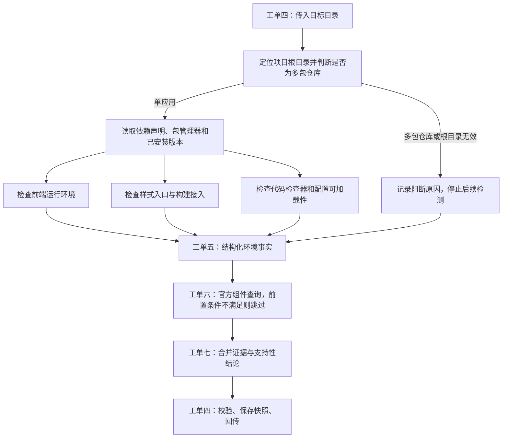
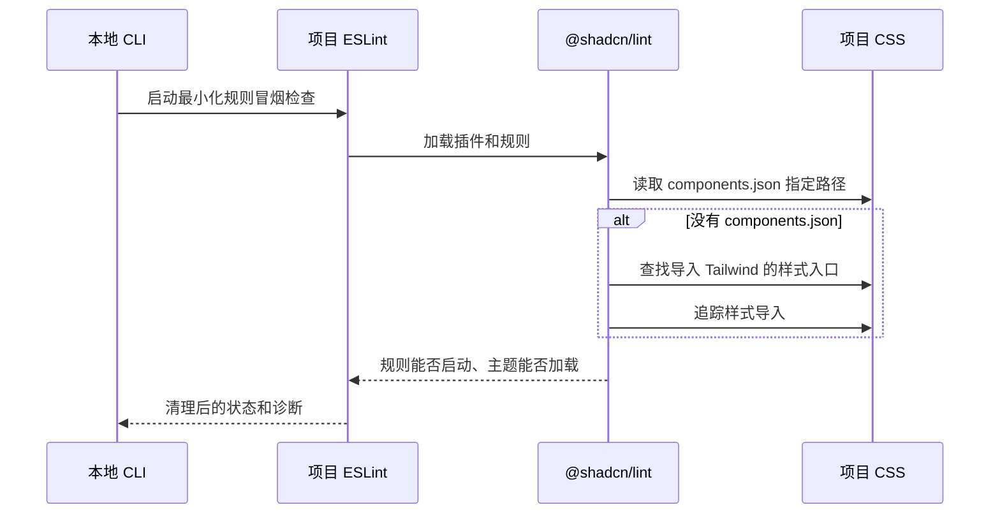

# 工单五讨论稿：基础项目环境检测

状态：方案讨论中，尚未实现检测代码。组件约束、官方组件查询和最终支持矩阵分别留在已约定的范围内。

## 1. 目标和交接关系

工单四已经解决在本地运行和上传结果。工单五负责提供“项目环境事实”，工单六负责官方组件查询，工单七负责合并事实并判断是否支持。



“停止继续”指停止后续扫描及产品接入，不是丢弃原因。多包仓库、缺少依赖等情况仍应形成可回传的结果，让网页解释为什么不能继续。

内部只保留一个环境检测入口：输入项目目录，返回环境事实。根目录识别、版本查询和配置检查作为它的内部步骤，不要求命令行执行器分别操作所有步骤。

## 2. 先修正当前模型的不足

现有共享协议主要按成功样例设计：必须有前端版本、样式版本、主题路径和包管理器锁文件；检查状态也只有通过与失败。工单五不能靠填入假版本或空路径满足这个协议。

建议增加四种检查状态：通过、不满足要求、无法确认、因前置条件而跳过。缺失版本和路径允许为空；每项结果带明确原因及证据。缺少依赖不等于检测程序崩溃。

典型区别：

| 观察到的情况 | 检测事实 | 后续处理 |
|---|---|---|
| 没有声明也没有解析到所需依赖 | 未发现所需依赖 | 提示补齐环境 |
| 声明了兼容版本范围，但本地尚未安装 | 已声明，实际版本未知 | 提示安装后重试 |
| 入口由动态构建逻辑生成 | 静态分析无法确认 | 不标记为“已接入” |

内部证据可以包含定位所需的本地绝对路径；对外结果只投影经过筛选的相对路径、版本和固定原因码。不能上传完整包清单、脚本内容、源码、运行环境或配置执行异常原文。

协议更新应增加模型版本，并同步服务端、命令行、旧快照处理和测试。旧快照可以明确拒绝为不兼容，或增加转换；不能默默把旧数据解释成新结论。这属于工单五的前置工作，不重新实现工单四的上传流程。

## 3. 工单五的根本判断

工单五不是为了收集框架名称，而是为了确认三种能力：Tailwind 能否作为样式底座运行、ESLint 能否加载并覆盖目标文件、@shadcn/lint 能否作为规则插件启动。

React、Vue 和 Svelte 对 Tailwind 的 CSS 主题本身没有决定性影响；它们主要影响 ESLint 对源码文件的解析方式，以及某个组件库的源码和导入约定。当前 MVP 只做基础 Token 和工具类规则，暂不做组件级 contracts，因此不应把 React 作为独立阻断条件，也不应为框架名称投入一套额外识别系统。

测试仓库是 React + Vite + Tailwind v4 + ESLint + shadcn 的真实样例，先用它验证静态主题入口和 ESLint 配置覆盖即可。以后支持 Vue/Svelte，主要增加对应 ESLint parser（解析器）和文件入口适配。

具体研究依据见 `docs/research/framework-impact-on-guardrails.md`。

## 3.1 主题定位为什么重要

主题定位是后续设计体系接入的前置条件，不只是为了在页面上显示“找到了哪个 CSS 文件”。如果用户在产品页面修改基础 Token 或语义映射，最终必须生成项目能够实际读取的主题产物；否则规则虽然可能写得正确，代码代理仍然看不到这些新 Token，也无法使用它们。


主题入口定位确实服务于后续 `apply`（应用配置）流程，但不属于“用代表文件验证 ESLint”的同一个动作。工单五只确认 Tailwind 和规则插件能运行，不声称已经找到可修改的主题文件。它本身不修改用户项目，也不解析全部 Token。后续主题接入功能必须采用可审查的文件写入方式，推荐生成一个产品托管的 CSS 文件并让现有入口导入它，保留差异预览和回滚信息；不建议直接覆盖用户整份 CSS。

如果只在 Web 保存 Token 和 Lint 配置，不把主题文件同步到用户项目，设计体系闭环就是断的：模型看不到新 Token，Lint 也可能读取另一份主题。因此“生成规则”和“同步主题产物”必须作为同一个后续接入流程验收。

## 3.2 `@shadcn/lint` 的文件范围

`@shadcn/lint` 是 ESLint 插件，不是只能接收单个文件的独立程序。ESLint 可以传入一个文件、一个目录或整个项目，例如后续正式检查使用：

```text
eslint .
```

插件会在每个被 ESLint 处理的文件上执行规则，同时按项目上下文读取主题、组件和导入关系。工单五选择代表文件，只是为了验证每种实际存在的文件类型是否有可用配置；它不是正式检查的范围限制。

正式流程应检查所有目标文件，覆盖范围由 ESLint 配置和文件类型决定。工单五需要按实际存在的扩展名和配置匹配情况做能力探测；工单七或后续检查阶段才运行完整项目规则。

## 4. 环节一：定位项目与多包仓库检查

输入：工单四确认存在的目录。

成熟能力：`node:fs`（文件系统能力）、`node:path`（路径处理能力）、`yaml`（结构化配置解析工具）。这些足够处理固定配置，不需要再为“向上找一个文件”引入完整框架。

自研判断：

- 从指定位置向上定位最近的应用包清单，设定仓库或明确目录边界，避免扫描到无关父目录。
- 检查所处仓库的工作区声明和配置成员关系；从多包仓库中的子应用执行，也要识别其上层工作区。
- `pnpm-workspace.yaml`（包管理器工作区与设置文件）也可能仅用于单包设置；要读取成员声明，不能仅凭这个文件存在就判定多包仓库。
- 检测到多包仓库按已确认方案直接阻断。
- 不能因为存在两个包清单或一个常见目录名就判定多包仓库；示例、测试样例和依赖目录也可能含包清单。
- 根目录有损坏配置时返回配置无效，不把它当作不存在。

输出：本地项目根目录、仓库结构结论、证据文件位置、阻断原因。

取舍：完整识别所有工作区工具会扩大范围。建议优先解析常见包管理器工作区声明；其他明确的多包配置标记不支持或待确认，不猜测为单应用。

## 5. 环节二：读取依赖与包管理器

输入：经过结构检查的项目根目录。

成熟能力：内置结构化数据解析、`semver`（语义版本范围比较工具）、`Node.js`（脚本运行环境）的项目相对模块解析。

自研判断：

- 包清单中的管理器声明与锁文件分别采集，遇到多个锁文件或声明冲突，明确显示冲突。
- 区分“声明版本范围”“实际安装版本”和“版本是否满足要求”，不能把范围开头的数字当作实际版本。
- 从用户项目解析依赖，不能误用我们命令行工具自己的依赖。检查解析目标所属位置，避免无意借用无关父目录的包。
- 不遍历整个依赖目录，但允许定点读取所需依赖的元数据；否则无法确认实际安装版本。
- 首版不为所有锁文件自研完整解析器。未安装时保留声明信息，并提示安装后再测。

输出：包管理器证据、所需依赖的声明范围和实际版本、未安装或冲突原因。

取舍：完整解析多种锁文件可在未安装时得到锁定版本，但维护成本更高，而且锁文件也不能证明本机已经能运行。建议首版优先实际安装元数据。

无依赖目录的特殊包解析模式，例如 `Yarn PnP`（即插即用依赖解析模式），需要专项适配。首版建议标明尚不支持，不擅自切换包管理器或自动安装依赖。

## 6. 环节三：确认 Tailwind 与代码检查能力

输入：依赖信息和根目录。

成熟能力：复用版本比较与文件读取。识别构建工具可以参考配置文件和相关依赖，但没有一个文件名能够证明整套运行环境正常。

自研判断：识别 `React`（前端视图库）及其网页运行依赖，并记录构建工具。只有视图库依赖并不必然是网页应用，例如原生移动端项目也可能使用它。

输出：前端依赖、实际版本、项目形态和后续入口识别所需的构建工具线索。

这一步不保证页面可以渲染；它为下一步选择入口识别方式。工单六的官方查询可以补充构建工具信息，但不能因此把安装版本检查交给启发式查询结果。

## 7. 环节四：检查样式是否接入

这是工单五中复杂度最高的一步。必须把“安装了框架”“存在样式文件”“文件被引入”和“构建接入存在”分开记录。

成熟能力：

- `fast-glob`（文件匹配工具）：限定范围发现候选文件，排除依赖、产物、缓存和版本控制目录。
- `PostCSS`（样式语法解析器）：只解析文本，不自动加载用户插件，读取导入、主题和其他指令。
- `TypeScript`（类型化脚本工具）的语法解析能力：读取静态导入和入口关系。
- 同一套工具的官方配置读取能力：解析注释、继承和路径映射，避免手写配置解析。既然已使用编译器，暂不另加 `get-tsconfig`（独立类型配置读取工具）。路径映射还要与构建工具实际配置交叉核对。

其中语法解析也可选择 `typescript-estree`（类型脚本语法树解析器）。它适合已围绕检查器语法树组织的项目；本项目同时需要模块路径分析，建议先使用官方类型脚本工具，不同时安装两套解析体系。

自研判断按证据链执行：

1. 确认安装版本为第四版。
2. 找到样式导入，必要时继续追踪共享样式文件的导入关系。
3. 从已知应用入口追踪静态源码导入和样式导入。
4. 检查构建集成声明，例如构建工具插件或样式处理插件；记录它是静态证据还是运行验证。
5. 对无法解析的动态导入、自定义入口和运行时条件标记未知，不能直接判失败或成功。

重要修正：

- 没有自定义 `@theme`（主题声明）并不意味着未接入。使用默认主题也是有效项目。
- 存在旧式配置文件不能直接证明仍使用第三版；第四版存在兼容加载方式。
- 不应只匹配一句固定导入文本。完整导入、拆分导入、共享样式和包导入需要按支持范围处理。
- 找到静态导入链仍不等于执行构建成功。报告应表达“静态接入证据完整”，不承诺最终样式已经生效。

输出：Tailwind 依赖、版本和运行接入证据。若检查中发现 CSS 线索，可以作为非阻断观察信息保存；可修改的主题入口留给后续主题接入阶段确定。

技术栈范围不变：仍为前端视图库、第四版样式框架和代码检查器。现有独立测试项目已经具备这三项，使用标准构建工具方式组织入口，应直接作为首个验收样例。

下面是实现覆盖范围的对比，不要求用户重新选择产品技术栈，也不把其他构建工具静默列为不支持：

| 方案 | 优点 | 代价 |
|---|---|---|
| 先完整处理标准 `Vite`（前端构建工具）项目 | 最快对应现有真实测试项目，规则容易验证 | 其他应用入口只能显示待确认 |
| 同时处理标准 `Vite`（前端构建工具）和 `Next.js`（网页应用框架） | 覆盖更常见的两类项目 | 需要分别处理应用入口、路由模式、样式限制并补两组样例 |
| 尝试任意前端构建配置 | 表面覆盖最广 | 动态配置无法普遍静态证明，不适合首版承诺 |

当前讨论先沿现有测试仓库展开，完成它的入口追踪和异常变体。其他项目若没有足够证据，应说明具体未确认的入口环节；不能把这种未知写成“没有使用前端视图库”，也不能直接承诺已验证所有构建方式。新增框架样例和入口适配再按实际需要讨论。

## 8. 环节五：检查代码检查器和 `@shadcn/lint`

输入：项目根目录、项目自己的检查器安装位置，以及一个代表性业务源码文件。

成熟能力：`ESLint`（代码检查器）的官方配置加载能力、`@shadcn/lint`（设计体系检查插件）和 `Execa`（子进程调用工具）。配置解析交给项目自己的检查器版本，不由产品猜测配置是否正确。

自研编排：

1. 检查实际版本及运行环境是否满足后续插件要求。
2. 确认项目能解析 `@shadcn/lint`，它不满足时记录“规则插件未安装”，不自动修改项目。
3. 在项目目录启动受超时约束的子进程，通过项目本地检查器加载代表性源码的配置。
4. 用最小化的 `@shadcn/lint` 冒烟检查确认插件能启动；这一步不运行完整项目检查，也不收集全部违规项。
5. 区分文件被忽略、没有匹配配置、插件缺失、配置执行失败、主题未找到和加载成功。
6. 只回传固定结论与清理后的原因，不回传配置全文和原始错误堆栈。

加载配置可能执行项目中的脚本，不能把它描述成纯静态读取。子进程便于超时和异常处理，但不是安全沙箱，也不能保证配置自己不会读取环境文件。我们能约定的是扫描器不主动收集环境文件、输出不上传环境内容。

### 主题发现如何交接

`@shadcn/lint` 不是独立的主题查询服务。我们应通过 ESLint 运行它，让官方插件自己完成主题发现：



这意味着工单五不实现 `@shadcn/lint` 内部的主题解析，也不把内部发现函数当作产品接口。工单五只记录：插件是否能启动、目标文件是否能解析。插件运行时可能读取当前主题，但它不会向产品提供一个可修改的主题文件路径。完整 `@theme`（主题声明）变量解析和可修改主题入口的确定，放在后续主题接入阶段。

如果项目没有安装 `@shadcn/lint`，或者官方插件无法加载主题，结果应明确阻止进入设计体系检查；不应该用产品自己的简化解析器假装已经验证成功。

沿用之前接受的“实际加载配置”方案，更有验证价值；仅检查文件存在虽然简单，但无法证明配置能用。此处不运行完整源码检查，也不自动修复或安装缺少的插件。

输出：实际版本、配置是否发现、代表性文件的匹配情况、可加载性、失败原因。单个代表文件通过不等于所有目录的配置都正确，报告需保留检查范围。

## 9. 各环节统一交接什么

每一步输出“观察到了什么”，而不是只有一个布尔值。

| 内容 | 例子 |
|---|---|
| 检查状态 | 通过、不满足、未知、跳过 |
| 检查值 | 声明范围、实际版本、入口路径，缺失时为空 |
| 证据 | 来自哪个相对路径、采用哪种检测方式 |
| 原因 | 未安装、配置无效、动态入口无法确认 |
| 建议 | 安装依赖后重试、指定入口、修复缺失插件 |

根目录是串行前置条件；依赖读取完成后，前端、样式和检查器检查可以在条件允许时并行。一个检查器配置失败不应吞掉已经得到的其他结果。结构被明确阻断时，后续项标记跳过。

工单五返回环境事实，工单六增加官方查询事实，工单七才决定整体支持性。当前工单四的检测入口直接要求最终结果，因此需要增加一个协调过程，把环境事实转成共享回传结构；组件查询未接入时必须标记未执行，不能伪装为“确认没使用”。

## 10. 测试应该覆盖哪些真实差异

- 已准备的独立测试仓库作为正常样例。
- 从应用子目录执行、从多包仓库子应用执行、缺少包清单。
- 版本范围与安装版本不同、未安装依赖、多个锁文件冲突。
- 只用默认主题、样式文件存在但未引用、间接导入、自定义动态入口。
- 检查器没有匹配文件、忽略业务文件、配置报错、加载超时。
- 所有阻断结果均能保存并回传，不泄露绝对路径、源码和配置执行输出。

这里只确定检测方法和边界，不要求现在运行用户项目的构建命令。若以后增加构建验证，应作为单独的验证能力，而不是静默加入环境扫描。

官方依据及工具边界记录在 `docs/research/ticket-05-detection-tools.md`（工单五工具研究笔记）。本文件仍为讨论稿，未安装新依赖或修改执行逻辑。


