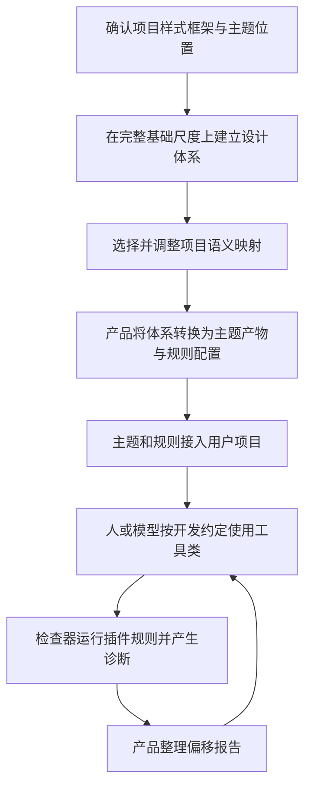

# 产品目的与开发工单对照

后续处理：阶段一工单和代码现已按本报告调整，执行结果见 [审核与消融记录](../phases/01-project-scan/review-and-ablation.md)。下文“现状”指调整前的审核快照。

日期：2026-09-28。依据为原始产品文档、后续用户确认的流程、当前工单和实际代码。本文是审视结果与调整建议，不直接修改代码或宣布尚未确认的方案已经确定。

## 1. 产品目的没有变

产品文档第 1.4 节明确分为：把设计体系变成可用主题、生成可执行约束、检查并展示偏移。第 5.3 节的原文是：

> 本产品：主题生命周期 + 规则包生成 + 报告可视化
>
> @shadcn/lint：执行检查 + agent 友好诊断

其中 `@shadcn/lint`（设计体系检查插件）执行规则，`agent`（编码代理）接收诊断。文档并没有要求它承担完整设计体系编译。之前把“插件不自动编译体系”作为对用户方案的反驳，是错误归因。

结合已确认的讨论，产品链路是：

原文第 2.3 节已经约定“只用 Tailwind 工具类”“不额外写游离的自定义 CSS（主题与规则文件除外）”。其中 `Tailwind`（样式框架）的工具类和 `CSS`（样式表）限定是产品前提。不能因为普通样式不在插件检查范围内，就断言这条产品路线不可行。

后续用户决定优先于早期草案：完整底座可视化和修改、组件库语义预设、暂不做组件级约束、不检查前端框架作为接入门槛、不在项目导入阶段运行规则。后面的主题应用方式仍待讨论，不能把某个“托管文件”方案当成已经批准。

## 2. 工单逐项结论

| 工单 | 现状判断 | 应保留或修正的内容 |
|---|---|---|
| 一：共享协议 | 方向有用，模型过早固定成功路径 | 当前代码要求框架必须为特定视图库、版本和主题路径必须非空、配置可加载性必须有布尔值。应允许未安装、未查询、未知路径，去掉框架必填和导入阶段执行检查的要求。 |
| 二：任务服务 | 支持本地检测结果回传，方向正确 | 创建、上传、查询与持久化可复用。它尚未实现主题版本、规则包和项目写入，这不属于工单二失败，也不能当作完整产品已完成。 |
| 四：命令行工具 | 执行和传输基础正确 | 目前只有显式通信演示，真实检测未接入。保留目录、快照、回传和重试能力，不把模拟结果算成设计体系检查。 |
| 五：导入前定位 | 反复加入了不必要的检测，需收敛 | 保留项目样式框架安装版本与主题路径定位。检查器安装与规则运行放到后续规则接入阶段。删除代表文件冒烟、全项目引用审计、前端框架门槛。 |
| 六：组件方案查询 | 仍然有用途，但不应主导设计体系 | 查询当前组件方案，帮助选择语义预设。官方返回的组件清单可附带保存，不逐组件生成约束。主题路径查询和组件方案查询须区分，不能重复实现两套主题选择。 |
| 七：结果汇总 | 应汇总“能否进入主题配置” | 不应把“尚未装检查器或插件”当作不能编辑主题。组件方案未使用与网络查询失败必须区分；无组件库路径仍有效。 |
| 三：检测页面 | 可保留 | 展示依赖与主题定位结果，允许确认主题路径及主要组件方案；不要展示未验证的“全项目已使用该主题”。 |
| 八：阶段一联调 | 可保留，但验收仍有旧要求 | 去掉框架强制检测和导入阶段检查器运行要求。验收只证明项目信息回传闭环，不证明设计体系约束已经生效。 |

多包仓库暂时阻止的决定保留；不因为本次范围修正重新引入多包支持。

## 3. 工单五主题查询的最新事实

官方确实公开了实验性 `project.themeFileFor`（主题路径查询）。发布版已经实测可独立调用，不需要执行检查规则。此前说没有公开接口并推导必须选择源码代表文件，是事实错误。

因此，建议用固定版本插件提供的查询能力完成主题定位，避免基于错误前提自研整套发现逻辑。是否正式替换目前“自研定位器”方案，需要按新证据确认，而不是悄悄改实现。

查询可以读取组件配置中的主题路径；缺少配置时自动寻找候选并选择。结果是选中的路径，不是应用运行时证明，也不是所有候选列表。用它辅助定位，之后让用户确认即可，不需要为工单五扩成全项目引用检查。

为了查询而让我们的工具依赖插件，不等于要求用户先把插件配置进项目，也不等于需要运行代码检查器。

## 4. 哪些可实现，哪些不能仅靠当前配置表达

设计体系转换环节是产品自身必须实现的能力，方向正确。其输出至少包括真实主题、插件配置和开发约定。关键是逐项验证配置所表达的约束与产品体系一致，而不是只确认配置语法合法。

### 可直接利用现有能力的部分

- 将基础尺度和语义映射输出成主题变量与工具类映射。
- 生成插件规则开关、诊断信息和项目使用约定。
- 利用官方规则检查任意值、原始颜色、未知类名等。
- 运行规则并把诊断整理成偏移报告。

### 需要在规则生成阶段做设计和验证的部分

| 问题 | 调查证据 | 对产品意味着什么 |
|---|---|---|
| 完整基础色板与语义色策略 | 禁止原始颜色规则默认不把内置色板当作项目显式颜色 | 产品要区分“体系中存在的基础色”与“业务允许直接使用的颜色”。若基础色允许使用，生成主题或配置时必须表达；不能原样套默认规则误报合法颜色。 |
| 完整动态尺度与有限批准阶梯 | 插件把十三像素任意值建议改为三点二五倍间距类，并允许后者 | 如果体系批准框架的完整动态尺度，符合目标；如果用户只批准有限档位，仅启用禁止任意值规则不够，需要额外的有限阶梯约束。 |
| 类名变量必须来自指定体系 | 变量短写不核实声明来源，普通元素动态类名不受静态类名规则完整覆盖 | 先在开发约定中限定命名主题类和静态完整类名；若产品要求自动发现这些违约写法，需要补针对性规则。不能说现有配置已全面实现。 |
| 允许列表的实际含义 | 颜色、任意值、未知类名规则中的允许项主要是检查豁免 | 不能把批准类名直接塞入允许项，就宣称列表外均被禁止。规则生成器需要按具体规则语义转换；必要时用补充规则表达不能配置的约束。 |
| 无诊断是否代表完整检查成功 | 主题加载失败可能降级检查；诊断范围取决于宿主和解析器 | 后续正式执行应记录实际检查范围和退化情况。完整覆盖不能通过“零报错”独立推导。 |

这些不是“产品做不到”。准确结论是：其中一部分可用官方配置完成，一部分可能需要产品自己的狭窄规则。开发约定与机器执行的部分应分别描述，不能把自研完整通用检查器作为默认前提。

## 5. 两项不能承诺的推导

第一，不能仅凭一次主题路径查询证明所有页面已经使用该文件。当前用户已决定不做引用审计，所以只需要诚实返回路径来源并让用户确认，不因此扩大工单五。

第二，不能仅凭生成插件配置证明任意设计体系都已成为完整机器白名单。配置只能表达插件已有的判断能力。如果特定体系超出这些能力，产品应生成补充约束，或者明确哪些由开发约定承担；不能悄悄放行并报告为机器保证。

这两条是不能成立的技术推导，不是用户提出过的职责分配。它们也不否定“产品自己完成转换，然后调用插件”的架构。

## 6. 阶段一之外还没有细拆的核心工作

当前八张工单明确属于阶段一，主要打通项目接入。因此没有覆盖下面内容，不等于产品文档遗漏，但之后必须单独拆工单：

1. 完整基础尺度展示、导入、编辑和项目语义映射。
2. 设计体系到主题文件、规则配置和开发约定的生成；明确每种政策由哪条规则执行。
3. 同一版体系产物接入项目，验证新增或修改的主题确实被构建与检查共同使用。
4. 正式规则执行、解析器接入和偏移报告。

建议在规则生成阶段加入最小验证表：体系允许的写法应通过，越界写法应报错。以颜色、间距、字号、圆角分别验证，而不是只测“文件生成成功”。

## 7. 文档和实现中尚未同步的内容

- 最小版本流程仍写“加载组件约定”“补充自定义组件约定”，与已移除组件约束的决定冲突。
- 最小版本流程和旧工单仍有特定前端框架必填，以及检查器可加载性作为早期门槛。
- 工单五当前本地文档仍包含检查器检查和引用关系追踪，与最近进一步收敛的讨论不一致。
- 协议与说明写有“检测中”，服务端目前没有开始检测上报接口；工单三不能直接显示为已支持的真实进度。
- 原始文档关于程序查询接口只能“跟进上游”的文字，已被新发现的实验性公开接口更新。
- 原始文档第 2.3 节“硬约束在声明的令牌集合内”的技术解释应补充动态尺度和变量短写的边界，但保留只用工具类、禁止游离样式的产品目标。

这些需要后续统一文档与协议，不必推倒已经完成的任务服务与传输程序。当前不进行新的检测或规则实现。

## 依据

- [原始产品文档](../product/design-system-guardrails-product-doc.md)：第 1.4、2.3、3.3、4、5.3、5.5 节。
- [最小版本流程](../product/mvp-product-flow.md)与[阶段一工单](../phases/01-project-scan/tickets.md)。
- [插件能力审计及发布包实测](shadcn-lint-capability-audit.md)。
- [官方项目查询接口](https://github.com/shadcn-ui/lint/blob/a89d04792f340bcea26af2d539a9eec7285fcc77/docs/api.md)。
- [官方规则配置语义](https://github.com/shadcn-ui/lint/blob/a89d04792f340bcea26af2d539a9eec7285fcc77/docs/rules.md)。
- 代码核对：共享结果模型、任务服务、命令行检测入口。这里只做范围与交接核对，不宣称完成全面代码质量审查。
