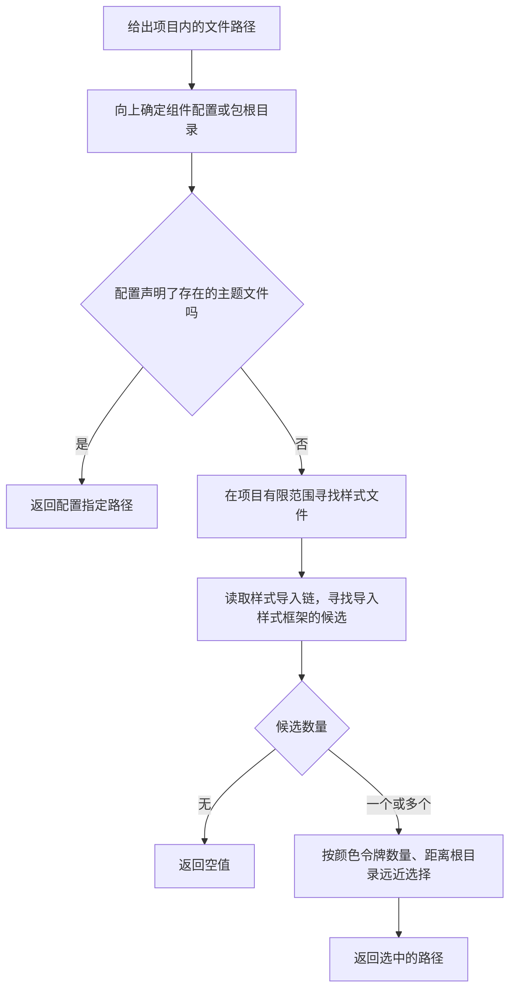

# 设计体系检查插件：能力与边界核对

- 核对日期：2026-09-28。
- 对象：`@shadcn/lint`（设计体系检查插件），不是安装组件的官方命令行工具。
- 发布版本：包仓库的最新版本为 `0.2.0`（发布版本号）。
- 文档与源码：固定在官方提交 `a89d04792f340bcea26af2d539a9eec7285fcc77`（本次核对的源码版本）。发布包没有提供源码提交编号，不将主分支文档自动视为发布包实测结果。
- 本文只记录调查结果，不改变工单范围，不要求增加组件级约束或允许例外。

产品职责澄清：原产品文档已明确“产品负责主题生命周期与规则包生成，插件负责执行检查”。用户没有要求插件自动编译完整设计体系。本文有关插件“不自动编译”的边界仅说明工具能力，不能作为否定产品自身转换环节的理由。产品与工单对照见 [开发方向核对](product-ticket-alignment-review.md)。

## 先纠正之前的说明

最重要的纠正：**官方确实提供主题路径查询接口，而且不需要先执行检查规则。**

官方原文：`The experimental project export exposes the information used by the rules. Its shapes may change before 1.0.`（实验性的项目导出暴露规则使用的信息；正式第一版发布前，结构可能变化。）其中包含 `project.themeFileFor(fromFile)`（根据项目内文件位置查询主题路径），返回路径或空值。[来源 1]

因此，之前说“没有公开主题查询接口，只能运行规则触发主题发现”是错误的；“必须拿一个代表文件进行规则探测才能找主题”也没有依据。这里的文件路径是**定位所属项目的起点**，不等于对那个文件进行代码检查。

另外还要纠正四点：

1. 它有六条规则，不只是工具类检查；也检查内联样式、部分矢量图颜色属性和组件样式覆盖。
2. 要求静态类名的规则只覆盖已识别组件及包装组件，不覆盖所有原生元素。
3. 禁止任意值不等于限制为一份有限的阶梯清单；默认间距单位下，官方会建议把十三像素改成对应的三点二五倍间距工具类。
4. 找到主题、主题能生成类名、应用实际加载了主题，是不同事实。插件不会修改应用导入，也不证明浏览器最终使用了该主题。

## 一、这个包是什么

它是面向 `Tailwind CSS v4`（第四版样式框架）设计体系的规则插件。它提供检查实现、项目与主题发现、组件识别、修复建议和可配置诊断信息；通过宿主运行，不是主题编辑器、主题生成器或组件安装器。[来源 2]

| 能力 | 官方提供的范围 |
| --- | --- |
| 执行宿主 | `ESLint`（代码检查器）或 `Oxlint`（高速代码检查器） |
| 样式框架 | 项目自己的第四版样式框架；未知类名规则调用它判断能否生成样式 |
| 前端语法 | 支持三种主流组件语法；模板检查需要对应解析器，见后文 |
| 组件方案 | 不要求安装官方组件库；自研组件和第三方组件可以通过导入匹配配置接入 |
| 主题查询 | 实验性公开项目接口，可以单独调用 |
| 检查范围 | 宿主选择文件，插件对每个纳入范围的文件执行已启用规则；不是只能检查一个文件 |
| 自动配置 | 没有内置共享预设，须显式启用规则；官方提供配置示例 |
| 设计体系生成 | 不读取任意设计令牌文件并自动生成全部主题或政策；它读取项目现有主题与配置 |
| 文件修改 | 不自动同步网页设计体系、不自动添加主题导入、不自动迁移项目 |

运行时最低版本为 `Node.js 20.19`（脚本运行环境）。官方文档要求 `ESLint 9.30+`（宿主版本）或 `Oxlint 1.80+`（另一宿主版本）。发布包依赖分类与实际导出见末尾验证记录；完整宿主和样式框架不是它捆绑的安装内容。[来源 1、2、17]

发布元数据进一步确认：直接依赖只有 `cn@0.3.2`（类名语法与分组工具）和 `@eslint/core@^0.17.0`（检查器核心辅助包）；后者不是完整宿主。完整宿主和脚本解析器被声明为可选对等依赖；样式框架没有被打包成它的运行依赖。包也没有独立命令入口。公开导出是包主入口及包描述文件，主入口包含默认插件、具名插件和实验性项目对象。因此安装插件、配置宿主、调用主题查询，是可以区分的步骤。[来源 17]

## 二、所有六条规则

### 1. 禁止任意值

`no-arbitrary-values`（禁止任意值）检查工具类中的方括号任意值和任意属性，例如直接写十三像素间距。即使数值刚好等于某个主题值，也要求改用对应工具类。[来源 3]

- 默认也检查宽度、外边距等布局值；官方示例中的布局豁免是可选配置，不是产品必须采纳的要求。
- 状态或选择器的任意变体不是任意设计值，不因此报错。
- 变量短写放行，不验证这个变量是否属于主题或已经声明。
- 支持精确间距替换、字号和圆角阶梯建议、相近颜色建议；无法推导时给一般提示。
- `scanAllStrings`（扫描所有字符串）可扩大到全部字符串字面量，也可能把说明文字当类名。

**对本产品重要的区别：**它检查是否使用工具类尺度，不自带“只有网页展示的几个阶梯才合法”的全局白名单。第四版样式框架的间距可以按基础单位推导。若我们保留完整动态尺度，这与产品目标可以一致；若以后只允许有限阶梯，就需要另定约束，不能把这条规则说成已经支持。

### 2. 禁止原始颜色

`no-raw-colors`（禁止原始颜色）检查基础色板工具类、未声明的颜色名、原生元素上的字面量矢量图颜色属性。[来源 4]

- 主题颜色来自主题文件及导入文件中的颜色命名空间，也支持背景色、文本色、边框色等专用命名空间。
- 样式框架自带色板不自动算项目显式声明的颜色；它倾向于让业务使用项目颜色词汇。
- 白、黑、透明、当前颜色和继承这些关键字默认允许。
- 方括号颜色由“禁止任意值”规则检查，不能只启用这一条。
- 颜色建议根据浅色主题值计算，不保证语义或暗色表现正确。
- 没有可读主题时仍能报基础色板，但不能可靠检查未声明主题颜色。
- 变量引用不验证声明来源；动态图形颜色表达式、组件属性、内联样式不属于该规则的图形属性检查范围。

### 3. 禁止内联样式

`no-inline-styles`（禁止内联样式）检查普通内联属性、无法读取的样式对象、自定义属性中的硬编码颜色，以及脚本组件中的样式元素。[来源 5]

- 普通内联属性即使值引用主题，也默认报错；官方建议改用类名。
- 自定义属性可以传动态值；默认只检查其中的硬编码颜色，不检查所有数值。
- 从别处导入的样式对象不跨文件解析，而是报告无法读取。
- 接收后透传的样式参数允许通过，当前文件编写的默认值和新增属性仍检查。
- 配置允许的属性会跳过该属性的后续检查。官方文档说拒绝列表也可报告本来放行的自定义属性，但发布包实测并不支持“拒绝所有自定义属性”：非颜色数值仍通过，见后文复现实验。
- 此规则不检查另外两种单文件组件中的样式块；那些属于普通样式文件语法。

因此，“启用这一条就禁止任何内联值”并不准确。也不能未经验证就声称加上拒绝列表可以关闭所有自定义属性通道。

### 4. 禁止未知类名

`no-unknown-classes`（禁止未知类名）调用项目安装的样式框架，加载主题、导入、自定义工具类、变体、插件和配置，判断类名能否生成样式，并提供拼写建议。[来源 6]

- 普通元素、组件和已识别类名辅助函数都可以检查。
- 主题导入图中的普通类选择器也被认作已知类，但它不审查选择器内部的声明是否来自主题。
- 已知标记、任意属性和普通类选择器绕过样式框架查询；其具体行为不由这条规则验证。
- “类名存在”不等于“在这里使用符合设计意图”，后者属于组件政策。
- 主题或样式框架加载失败时，会警告并降级到内置语法判断。降级检查较弱，某些错误变体或虚构值可能通过。

**不能将无诊断直接当作主题加载成功。**这条规则有降级路径。

### 5. 要求静态类名

`require-static-classes`（要求静态类名）对已识别设计体系组件和转发包装组件，报告无法静态读取的类名部分。[来源 7]

- 静态字符串、完整类名之间的条件选择、已知辅助函数可以读取。
- 同文件常量、未重新赋值变量通常追踪一层；跨文件导入的类名值不追踪。
- 未知函数调用和动态拼接会在已识别组件上报告；已知的那部分类名仍交给其他规则。
- 原生元素不受这条规则检查；它不是全项目“禁止动态类名”规则。
- 不透明的整包属性展开可能被略过；接收类名后透传允许。
- 没有允许、拒绝或组件政策选项，主要配置识别范围和提示文本。

### 6. 限制组件重新设置样式

`no-restyle`（限制组件样式覆盖）根据组件政策决定调用方能传哪些类名，结合组件源码里的变体和尺寸给建议。[来源 8]

- 只作用于识别到的设计体系组件，不作用于所有原生元素或无关组件。
- 可允许布局，限制颜色、排版、内间距、形状、效果、运动等类别，也可逐组件配置。
- 不传允许和拒绝列表时，已识别组件上的所有类名都可能报告；并非自带一套所有官方组件的完整固定政策。
- 可追踪重导出、重命名、包装组件转发，以及可读取的渲染参数；变体可从变体函数和部分类型定义读取。
- 不追踪父元素选择器对子组件的视觉覆盖；规则匹配的是类名与分组，不是所有等效样式行为。

这一能力确实存在，但当前产品已决定暂不做组件级约束。调查列出它，不代表重新加入最小版本。

## 三、配置能做什么，不能误读什么

所有规则可以分别设置关闭、警告、错误，宿主控制文件范围。除要求静态类名以外，规则支持 `allow`（允许项）、`deny`（撤销允许项）、`contracts`（组件政策）；所有规则支持自定义提示。[来源 9]

**这些选项不是一套统一的全项目白名单。**

| 配置 | 实际含义 |
| --- | --- |
| 在组件覆盖规则中设置允许列表 | 决定组件允许接收的类名 |
| 在颜色、任意值、未知类名规则中设置允许列表 | 豁免匹配项，不是“列表外都禁止” |
| 只设置拒绝列表 | 除匹配项外，其他项可能全部豁免；不能误以为更严格 |
| 空允许列表加拒绝列表 | 没有通用豁免，再处理拒绝项；具体仍按每条规则语义 |
| 对合法颜色设置拒绝项 | 不会让已声明颜色变成原始颜色 |
| 对合法类名设置拒绝项 | 不会让可生成类名变成未知类名 |

匹配支持类别、类分组、精确类名和通配符。组件政策按解析后的组件名匹配；多个政策同时匹配时只使用最后一个，继承顶层未覆盖字段，不累积前面的政策。内联样式规则按写出的组件名匹配，不解包装组件。

还可以登记额外组件导入位置、忽略位置、类名合并函数、变体函数；共享提示可以把项目自己的设计要求放进每次诊断中。提示支持主题文件、推荐值、组件尺寸等占位符，长度有限。官方组件目录豁免和布局豁免只是采用建议，**我们可以选择不生成这些豁免**。[来源 9、10、11]

## 四、它能读哪些源码写法

可以读取类名属性及类似属性、类名对象、已知辅助函数、同文件变量的一层初始化、条件表达式、数组、对象、可读取的展开对象；也读取内联样式和原生元素图形颜色属性。[来源 12]

内置辅助函数包括常见的类名合并工具、变体定义工具；可登记额外函数。登记函数表示“这些参数就是类名”，插件不会执行函数证明其返回结果。

| 项目类型 | 可覆盖内容 | 明确限制 |
| --- | --- | --- |
| `React`（前端组件库） | 脚本组件类名、表达式、内联对象、组件转发；变体可从部分类型联合读取 | 跨文件样式值、不透明展开、原生元素动态类名仍有边界 |
| `Vue`（前端框架）配对应解析器 | 模板类名、绑定、数组对象、样式字符串和对象、脚本辅助函数 | 普通样式块、另一种模板语言、直接读取透传属性中的类名不覆盖；类型属性变体不按前一种方式读取 |
| `Svelte`（前端框架）配对应解析器 | 模板类名、条件类指令、样式指令、展开、脚本辅助函数 | 普通样式块不覆盖；动态元素没有可识别组件身份 |
| 后两者使用高速检查器 | 只读取脚本块 | 不读取模板，官方会警告；需要模板检查应使用支持对应解析器的宿主 |

框架名称本身不是基础主题的限制；**源码格式和所用解析器决定规则能看见什么**。现有项目配置正确时可以复用，无需因为主题查询就先建立一套框架识别系统。[来源 13、14、15]

## 五、主题发现到底怎么做

这是官方提供的独立能力，不需要运行任何一条规则。[来源 1、16]



官方调用形式：

```ts
import { resolve } from "node:path"
import { project } from "@shadcn/lint"

const themePath = project.themeFileFor(resolve("src/app/page.tsx"))
```

`themePath`（返回的主题路径）来自 `project.themeFileFor`（主题查询方法）；传入路径用于定位项目。**这个例子没有加载代码检查器，也没有解析页面来执行规则。**

它会向上寻找 `components.json`（组件配置文件），读取 `tailwind.css`（主题路径字段）；缺失路径会警告并自动查找。没有配置时，以最近的包根目录为依据。上级组件配置可能影响嵌套目录的查询，不能擅自理解为只查询最近的包。自动查找选择导入样式框架的入口，而不是仅含令牌的片段；有多个时优先颜色令牌多者，其次更靠近项目根目录者。[来源 12、16]

源码中的自动查找有目录深度和文件数量限制，并跳过依赖目录、构建目录、公开静态资源目录及隐藏目录等；只查样式文件，不是一个无限遍历项目的完整构建分析器。其返回值是一个路径或空值，**不提供完整候选清单和歧义状态**。[来源 16]

还要区分：组件配置可以指向只含令牌的文件；内部未知类名检查可能另找真正导入样式框架的入口。对外主题路径和内部编译入口因此可能不同。内部编译入口查询函数未包含在公开项目导出中。[来源 16]

**返回路径不能证明应用已导入该文件，也不能证明唯一正确。**这是配置优先、启发式补充的发现能力。若用于后续修改，页面应明确展示选中路径，让用户能发现不符合项目意图的选择，而不是将启发式结果称为运行时证明。

## 六、公开接口与主题解析范围

| 公开项目方法 | 返回什么 | 是否完整设计体系模型 |
| --- | --- | --- |
| `projectFor`（项目查询） | 项目根、配置、别名、声明的主题路径等元信息 | 否 |
| `themeFileFor`（主题路径查询） | 路径或空值 | 否，仅定位 |
| `colorTokensFor`（颜色名称查询） | 颜色名称集合或空值 | 否，不是全部颜色值和模式 |
| `componentsFor`（组件索引查询） | 目录、组件文件和识别能力 | 否 |
| `variantDefinitionsOf`（组件变体定义查询） | 变体定义、轴和来源 | 否 |
| `variantNamesFor`（组件变体名称查询） | 某组件可用变体名称或空值 | 否 |

插件内部会读取主题导入、颜色命名空间、部分字号和圆角尺度、基础间距、根选择器变量，生成建议时跳过暗色块并比较浅色值。**内部能读这些，不等于公开了一套完整令牌导入、编辑和导出接口。**分组表、收集器、缓存以及完整解析过程仍是内部实现。[来源 1、12、16]

公开项目接口标注为实验性。采用它的合理成本是固定版本、封装调用并做针对查询结果的回归验证；不需要复制全部内部实现，也不需要为了查询路径先运行规则。是否采用仍属于后续方案选择，本文不代替用户修改工单。

## 七、诊断、建议、自动修复不是同一件事

颜色邻近值、精确尺度替代、拼写纠正可以形成编辑器建议，带有替换文本的位置；这需要用户或开发工具选择应用。组件覆盖规则主要给变体和尺寸指导，不自动重构组件。[来源 3、4、6、8]

发布包实测：六条规则都没有声明自动修复能力；颜色、任意值、未知类名三条提供编辑器建议。对任意间距样例启用宿主自动修复后，代码没有被修改，错误仍存在。**编辑器建议不是自动修复。**也不能因为两种颜色接近，就认为它们的产品语义或暗色对比度相同。

插件存在跨文件分析缓存和样式框架工作线程。改主题、组件或依赖后，宿主的文件缓存可能跳过没有改动的使用方；官方建议重新运行不带文件缓存的检查，必要时重启长驻进程。插件不是后台主题监控或配置同步服务。[来源 18]

## 八、对我们“业务只写工具类”的目标意味着什么

这个目标可以采用，官方插件对它有很直接的价值：主题定义可用词汇，规则禁止任意值、原始颜色、未知类名和普通内联属性，再把错误转成模型可用的修改建议。**不需要为了支持被产品禁止的普通样式声明，先建设一个完整通用样式检查器。**

但不能将“业务只写工具类”误写成“现有六条规则已机器保证所有值都来自指定主题”。下面是工具类路径本身也存在的区别：

| 产品要求 | 当前插件的真实能力 | 我们需要明确的策略 |
| --- | --- | --- |
| 使用主题颜色 | 主题颜色识别和原始色检查可复用 | 默认色板是否纳入批准范围，由产品定义，不能直接照抄语义色限定 |
| 不用任意设计值 | 能禁止方括号值和普通内联属性 | 不生成布局豁免；非颜色自定义属性不能仅靠现有拒绝选项完全封闭 |
| 所有变量来自指定主题 | 变量短写默认允许，不验证其来源 | 约定只用命名主题类；需要机器保证时补针对性规则 |
| 所有类名都可静态读取 | 对已识别组件可检查 | 原生元素的动态拼接不在静态类名规则范围 |
| 所有间距来自有限阶梯 | 接受基础单位推导出的合法间距 | 先决定完整动态尺度还是有限批准阶梯 |
| 不写普通样式声明 | 外部样式文件不在规则范围 | 可先作为明确开发约定；若要求自动拦截，再补狭窄的禁止检查 |
| 不能自行扩大设计体系 | 新声明令牌默认成为允许词汇 | 主题修改权限和审查属于产品职责 |

官方允许例外，不代表我们的产品需要允许。我们可以不给用户生成任何例外配置。**这里记录的边界，是为了准确选择配置和少量补充能力，不是降低产品目标。**

## 九、对当前工单的调查结论

1. 检查已安装的样式框架和版本，服务于后续使用它的主题体系。
2. **主题路径可以直接通过官方实验性接口查询，不必调用规则，也不必先检查或运行代码检查器。**此前围绕代表文件冒烟检查的推导应撤回。
3. 创建规则配置文件本身不需要运行代码检查器；真正使用规则时才需要宿主、插件和适合目标语法的解析器。
4. 主题路径查询不是全项目主题引用审计，不能自动证明应用实际使用了它。
5. 后续产品产物应是“真实主题文件 + 插件规则配置 + 开发约定”；不要描述成插件自动把任意完整设计体系编译成全覆盖白名单。

## 十、发布包复现实验

在独立研究目录全新安装发布包，不使用开发分支替代。配置开启全部六条规则为错误，仅为覆盖能力调查，**不是产品最终配置，也不重新启用产品已排除的组件级约束**。

实测版本：`@shadcn/lint@0.2.0`（插件）、`eslint@10.11.0`（宿主）、`@typescript-eslint/parser@8.70.1`（解析器）、`tailwindcss@4.3.3`（样式框架）；运行环境为 `Node.js v24.13.0`（脚本运行环境）。

| 样例 | 结果 |
| --- | --- |
| 已声明主题颜色配标准间距 | 通过 |
| 方括号十三像素间距 | 报任意值，建议三点二五倍间距类 |
| 三点二五倍间距类 | 通过 |
| 未在项目声明的基础蓝色色板类 | 报原始颜色 |
| 未声明的命名颜色类 | 报未声明颜色 |
| 引用未声明变量的颜色短写 | 通过 |
| 白色工具类 | 通过 |
| 主题导入图中存在的普通样式类 | 通过，即使该普通声明使用硬编码间距 |
| 拼错的布局类 | 报未知类名，提供拼写建议 |
| 普通内联十三像素间距 | 报内联样式 |
| 本地自定义属性赋十三像素，再通过工具类引用 | 通过 |
| 普通元素动态拼接颜色类 | 通过 |
| 已识别按钮组件动态拼接颜色类 | 报无法静态读取 |
| 已识别按钮组件传入内间距类 | 报组件重新设置样式 |
| 脚本组件中的样式标签 | 报内联样式 |

另外验证了三个容易误解的点：

1. 单独导入公开项目对象，直接查询主题路径和颜色名称成功；没有启动宿主，也没有执行规则。
2. 六条规则均无自动修复声明；开启自动修复不替换任意值示例，编辑器建议仍保留。
3. 对内联样式设置 `allow: [], deny: ["--*"]`（空允许列表并拒绝全部自定义属性）后，非颜色数值仍未被报告。该版本源码仍先判断是否携带硬编码颜色，无颜色时不产生诊断。因此不能只根据文档中的“可以拒绝自定义属性”推断全面封闭能力。

另在没有上级组件配置的三个独立目录，仅调用主题查询接口：存在单个导入样式框架的文件时返回该文件；存在两个候选时返回颜色令牌更多的文件；没有样式文件时返回空值。该过程同样没有执行检查规则。

复现脚本、结构化结果和运行说明保存于本文同目录的 `shadcn-lint-evidence`（发布包复现实验目录）。这些实验验证具体行为，不是对任意项目、任意语法的穷尽证明。

## 一手来源

以下仓库链接均固定在本次源码版本，避免主分支后续更新改变依据。

1. [公开接口说明](https://github.com/shadcn-ui/lint/blob/a89d04792f340bcea26af2d539a9eec7285fcc77/docs/api.md)
2. [官方项目说明与安装方式](https://github.com/shadcn-ui/lint/blob/a89d04792f340bcea26af2d539a9eec7285fcc77/README.md)
3. [禁止任意值规则](https://github.com/shadcn-ui/lint/blob/a89d04792f340bcea26af2d539a9eec7285fcc77/docs/rules/no-arbitrary-values.md)
4. [禁止原始颜色规则](https://github.com/shadcn-ui/lint/blob/a89d04792f340bcea26af2d539a9eec7285fcc77/docs/rules/no-raw-colors.md)
5. [禁止内联样式规则](https://github.com/shadcn-ui/lint/blob/a89d04792f340bcea26af2d539a9eec7285fcc77/docs/rules/no-inline-styles.md)
6. [禁止未知类名规则](https://github.com/shadcn-ui/lint/blob/a89d04792f340bcea26af2d539a9eec7285fcc77/docs/rules/no-unknown-classes.md)
7. [要求静态类名规则](https://github.com/shadcn-ui/lint/blob/a89d04792f340bcea26af2d539a9eec7285fcc77/docs/rules/require-static-classes.md)
8. [限制组件样式覆盖规则](https://github.com/shadcn-ui/lint/blob/a89d04792f340bcea26af2d539a9eec7285fcc77/docs/rules/no-restyle.md)
9. [全部规则选项与政策语义](https://github.com/shadcn-ui/lint/blob/a89d04792f340bcea26af2d539a9eec7285fcc77/docs/rules.md)
10. [已有项目采用流程](https://github.com/shadcn-ui/lint/blob/a89d04792f340bcea26af2d539a9eec7285fcc77/docs/adoption.md)
11. [设计体系配置和共享政策](https://github.com/shadcn-ui/lint/blob/a89d04792f340bcea26af2d539a9eec7285fcc77/docs/design-systems.md)
12. [工作原理与分析边界](https://github.com/shadcn-ui/lint/blob/a89d04792f340bcea26af2d539a9eec7285fcc77/docs/how-it-works.md)
13. [脚本组件配置](https://github.com/shadcn-ui/lint/blob/a89d04792f340bcea26af2d539a9eec7285fcc77/docs/react.md)
14. [Vue（前端框架）配置](https://github.com/shadcn-ui/lint/blob/a89d04792f340bcea26af2d539a9eec7285fcc77/docs/vue.md)
15. [Svelte（前端框架）配置](https://github.com/shadcn-ui/lint/blob/a89d04792f340bcea26af2d539a9eec7285fcc77/docs/svelte.md)
16. [主题发现源码](https://github.com/shadcn-ui/lint/blob/a89d04792f340bcea26af2d539a9eec7285fcc77/packages/lint/src/project/theme.ts)、[项目定位源码](https://github.com/shadcn-ui/lint/blob/a89d04792f340bcea26af2d539a9eec7285fcc77/packages/lint/src/project/components-json.ts)、[公开导出源码](https://github.com/shadcn-ui/lint/blob/a89d04792f340bcea26af2d539a9eec7285fcc77/packages/lint/src/index.ts)
17. [包仓库发布元数据](https://registry.npmjs.org/@shadcn%2Flint/0.2.0)
18. [官方故障排查与缓存说明](https://github.com/shadcn-ui/lint/blob/a89d04792f340bcea26af2d539a9eec7285fcc77/docs/troubleshooting.md)
